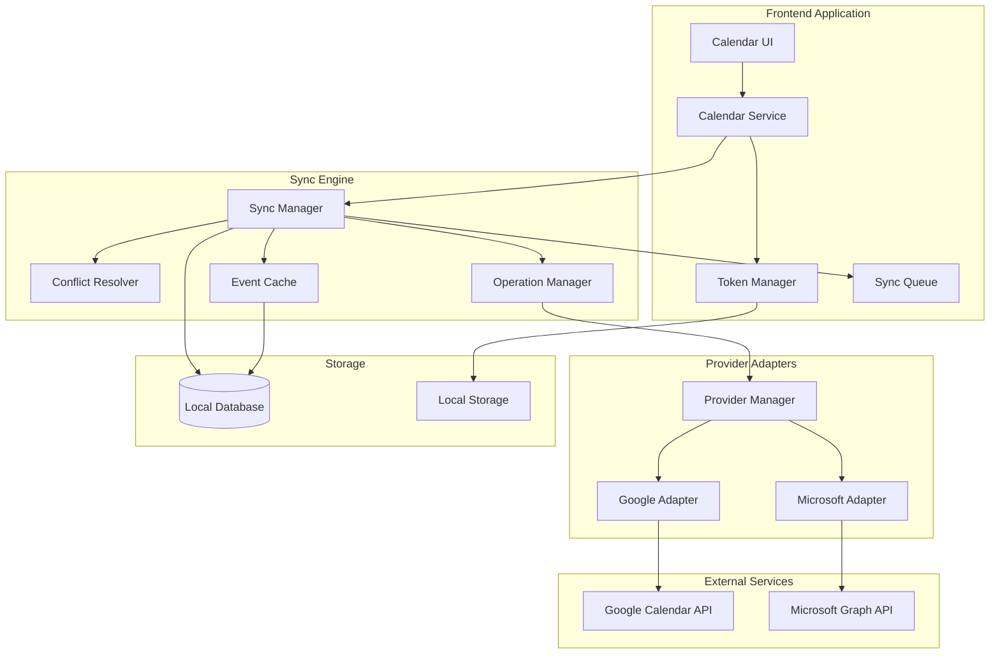
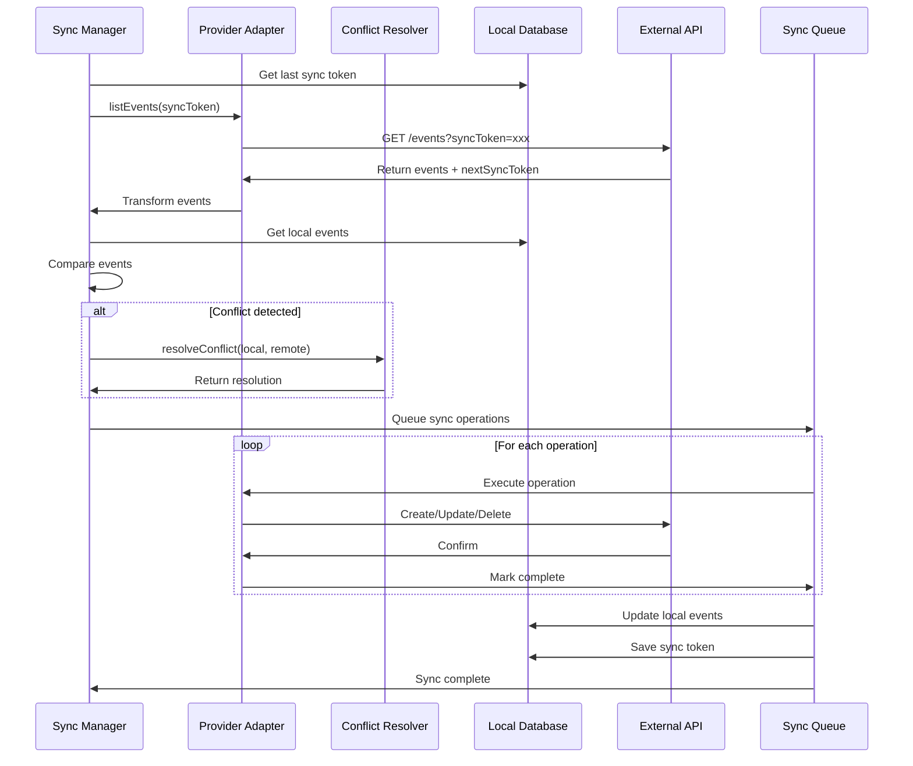
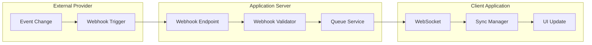
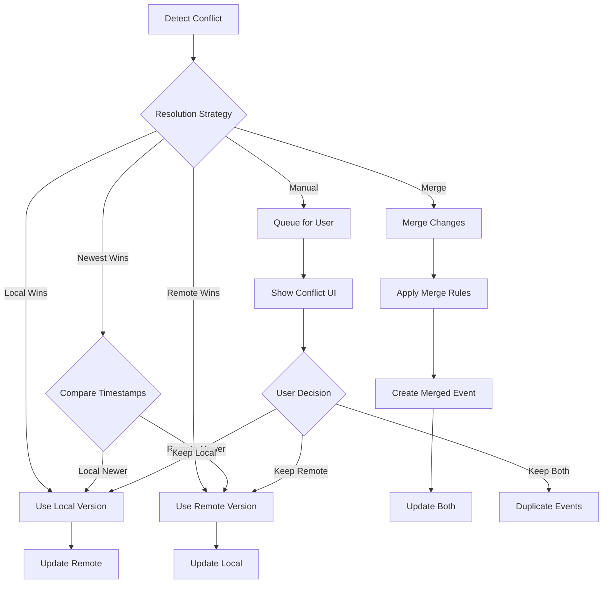
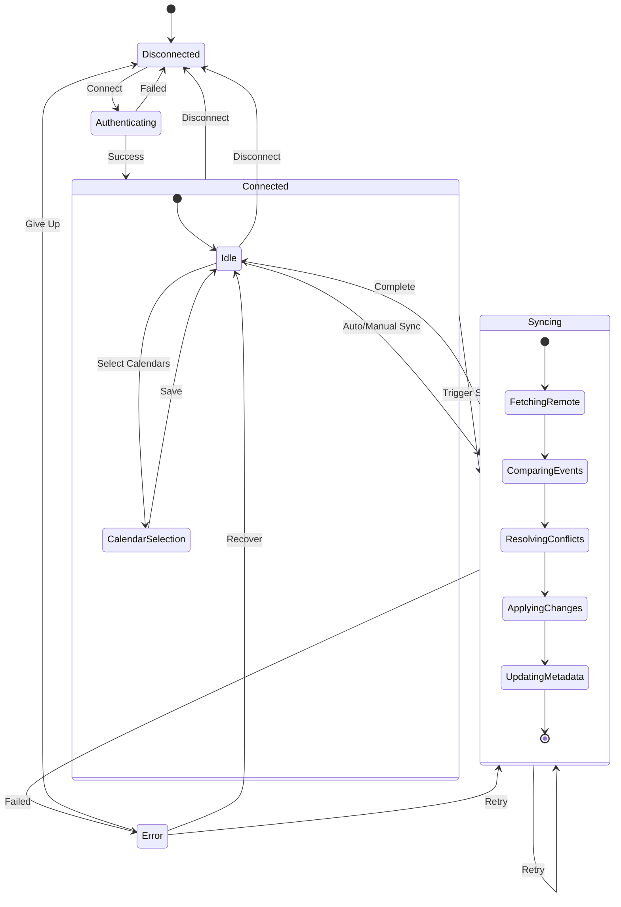
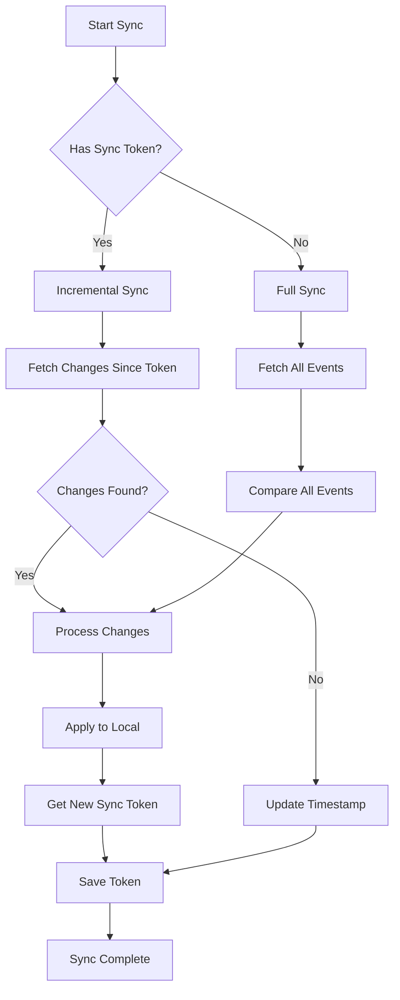
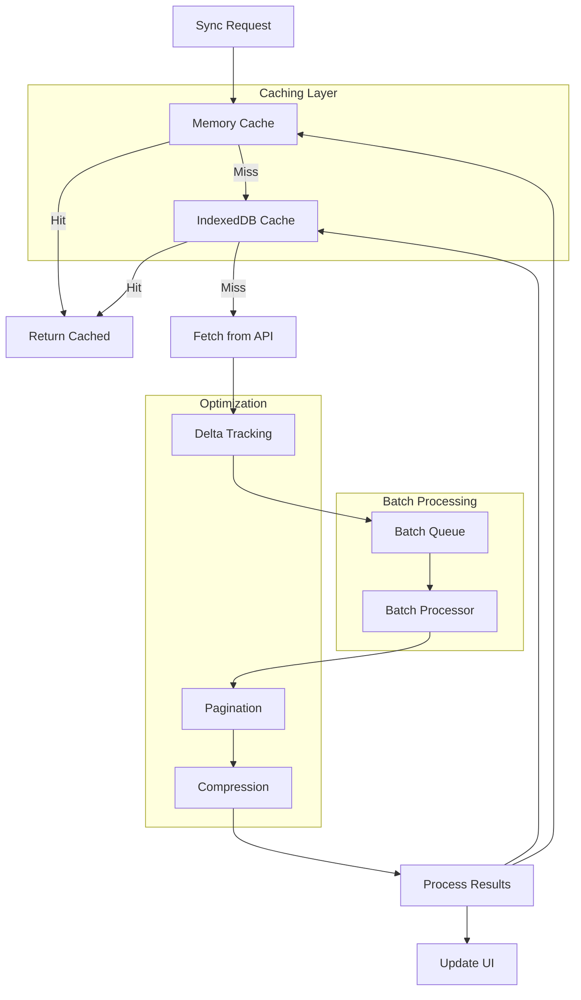
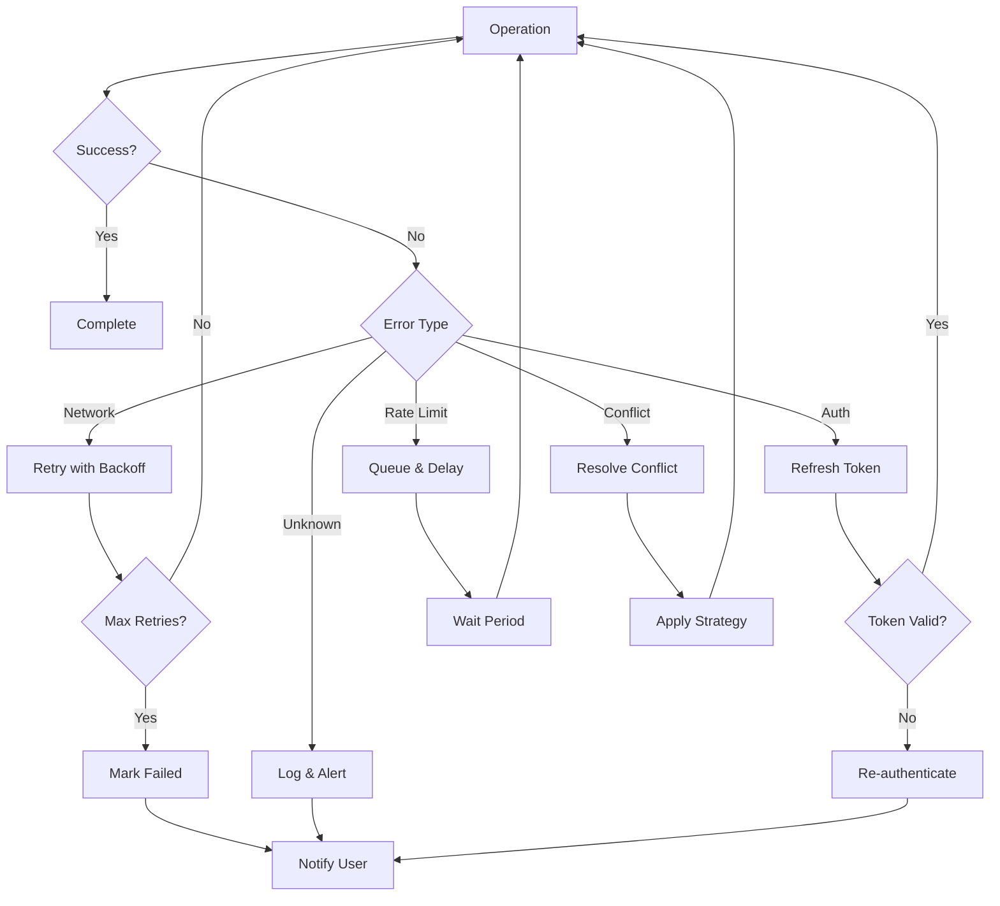
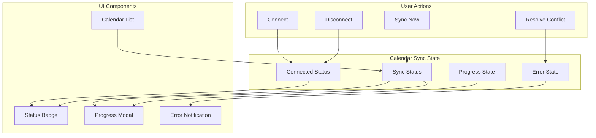

# Calendar Sync Flow Diagrams

## 🔄 Overall Sync Architecture



## 🔐 OAuth Authentication Flow

```mermaid
sequenceDiagram
    participant U as User
    participant A as App
    participant AS as Auth Service
    participant G as Google/Microsoft
    participant TM as Token Manager
    participant DB as Database

    U->>A: Click "Connect Calendar"
    A->>AS: initiateOAuth(provider)
    AS->>AS: Generate state & PKCE
    AS->>G: Redirect to OAuth URL
    G->>U: Show consent screen
    U->>G: Grant permissions
    G->>A: Redirect with code
    A->>AS: handleCallback(code)
    AS->>G: Exchange code for tokens
    G->>AS: Return tokens
    AS->>TM: saveTokens(tokens)
    TM->>DB: Encrypt & store
    AS->>A: Success
    A->>U: Show connected status
```

## 📅 Event Sync Flow



## 🔄 Real-time Update Flow



## ⚡ Conflict Resolution Flow



## 🗂️ Data Sync State Machine



## 🔄 Incremental Sync Strategy



## 📊 Performance Optimization Flow



## 🚨 Error Handling Flow



## 📱 UI State Management



These diagrams provide a comprehensive visual representation of the calendar integration architecture, showing how different components interact and how data flows through the system.